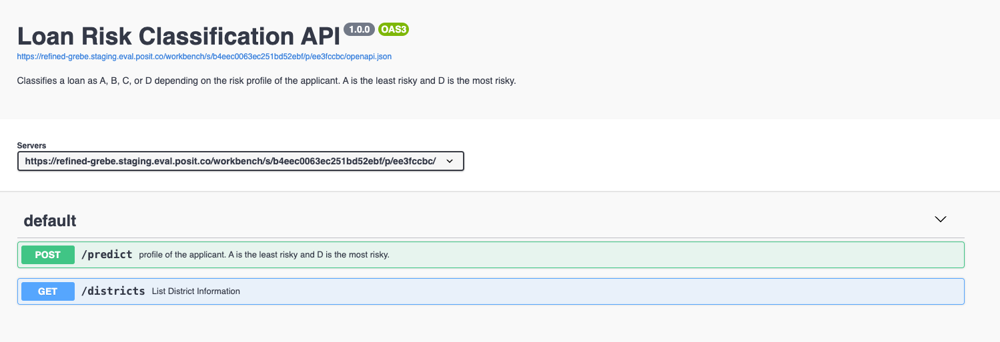

# Loan Risk Prediction Model using a Plumber API

A loan risk prediction model created using [tidymodels](https://www.tidymodels.org/)/[xgboost](https://xgboost.readthedocs.io/en/stable/R-package/xgboostPresentation.html) surfaced as an API using [plumber](https://www.rplumber.io/).



## Usage

Setup the `renv` environment:

```r
renv::activate()
renv::restore()
```

To run the API locally:

Open the `api/plumber.R` file in the IDE and click the "Run API" button.

## Deployment

### Push Button

Open `api/plumber.R` and use the blue publish icon in the upper right corner of the IDE code pane.

### rsconnect package

You can also deploy using the rsconnect package:

```
rsconnect::deployAPI(
  api = "api",
  appTitle = "Loan Risk Model Plumber"
)
```

### Git-backed

Update the code, and then run:

```r
rsconnect::writeManifest("api")
```

Commit the new `manifest.json` file to the git repo along with the code.

## Training

This example has a pre-created `model` directory. If you wish to re-run the training then run the `train.R` script.

## Resources

[Posit Connect User Guide: Plumber](https://docs.posit.co/connect/user/plumber/)
[Tidymodels Getting Started](https://www.tidymodels.org/start/)
