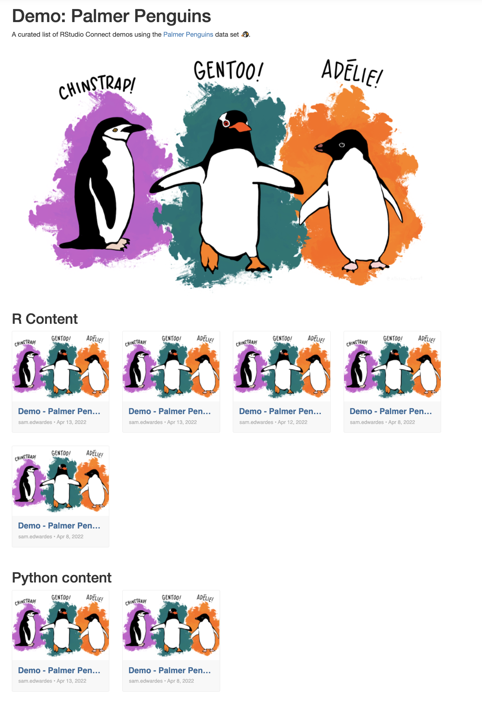

# Using connectwidgets with Posit Connect

A demo of connect widgets in RStudio Connect.



## Environment variable requirements

This content needs to have the following environment variables set to function:
- `CONNECT_SERVER` the URL of your Connect server, for Test Drive it will be in this format: https://YOUR_DOMAIN_HERE.eval.posit.co/cnct
- `CONNECT_API_KEY` an API key from your Connect server. See [API Keys](https://docs.posit.co/connect/user/api-keys/) in the Connect User guide for more information.
 
For your convenience, both of these environment variables are already set in Test Drive sessions (put in `~/.bash_profile`). This content should work without further action from within the Test Drive environment.

## Usage

Setup the `renv` environment:

```r
renv::activate()
renv::restore()
```

To render the report either open `report/connectwidgets-penguins.Rmd` and use the "Knit" button on the top of the IDE code pane and select "Knit to HTML" or use:

```r
rmarkdown::render("report/connectwidgets-penguins.Rmd")
```

## Deployment

### Push Button

Open `report/connectwidgets-penguins.Rmd` and use the blue publish icon in the upper right corner of the IDE code pane.

### rsconnect package

You can also deploy using the rsconnect package:

```
rsconnect::deployDoc(
  doc = "report/connectwidgets-penguins.Rmd",
  appTitle = "Connect Widget Example"
)
```

### Git-backed

Update the code, and then run:

```r
rsconnect::writeManifest(
  "report", 
  appFiles = c("connectwidgets-penguins.Rmd", "imgs")
)
```

Commit the new `manifest.json` file to the git repo along with the code.

## Resources

[Posit Connect How-to Guide: Custom Landing Page with connectwidgets](https://docs.posit.co/connect/how-to/connectwidgets/index.html#connectwidgets)
