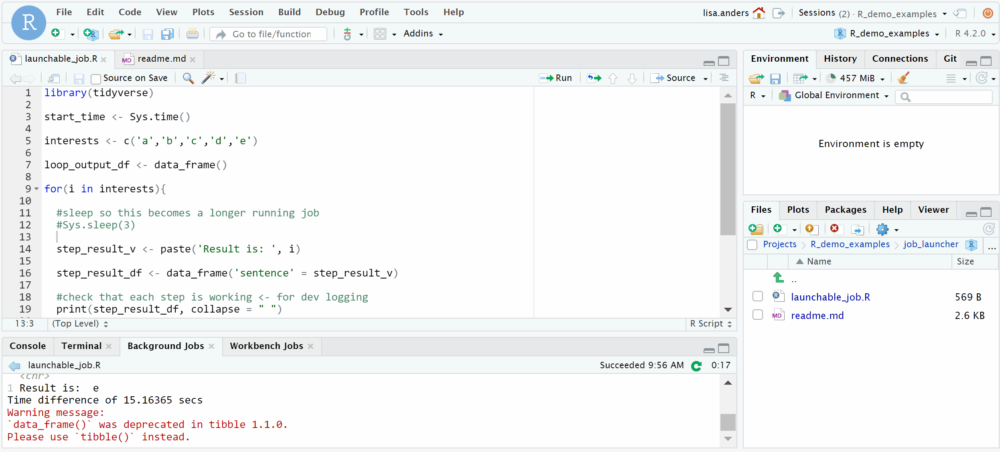

# Jobs in RStudio

Note: This page is using text from [here](https://solutions.rstudio.com/r/jobs/) and the [blog post](https://www.rstudio.com/blog/rstudio-1-2-jobs/), both very good references. 

Long running tasks like simulation studies can be run as background or launched into remote resources in order to keep your original R session open for other work.

There are two ways to run scripts in the background: 

 - Background Jobs (AKA Local jobs)
 - Workbench Jobs (AKA `Job Launcher` or Remote Jobs)
 
The [rstudioapi package](https://github.com/rstudio/rstudioapi) provides tools for programmatically creating local and Launcher jobs. If you’d like to show progress and/or output from a task using the jobs UI, refer to the rstudioapi documentation for details; start with `addJob`, which creates a new job in the UI and returns a handle you can use to update the UI as the job progresses.

## Background jobs

Background jobs will run scripts for you in the background using your local resources. This is built in to the RStudio IDE and available open source. 

By default, the job will run in a clean R session, and its temporary workspace will be discarded when the job is complete. This is the fastest and safest configuration, good for reproducible scripts that have no side effects.

However, if you want to feed data from your current R session into the job, or have the job return data to your current R session, change the dialog options as follows:

Run job with copy of global environment: If ticked, this option saves your global environment and loads it into the job’s R session before it runs. This is useful because it will allow your job to see all the same variables you can see in the IDE. Note that this can be slow if you have large objects in your environment.

Copy job results: By default, the temporary workspace in which the job runs is not saved. If you’d like to import data from your job back into your R session, you have a couple of choices:

 - Global environment: This places all the R objects your job creates back in your R session’s global environment. Use this option with caution! The objects created by the job will overwrite, without a warning, any objects that have the same name in your environment.

 - Results object: This places all the R objects your job creates into a new environment named yourscript_results.

## Workbench Jobs

Remote background jobs are a feature of RStudio Workbench and are orchestrated by the Launcher, which also supports running interactive sessions on remote resource managers like Kubernetes. 

When launching a job, you’ll have the opportunity to specify how you want to run it, depending of course on the configuration the compute infrastructure exposes to RStudio Server. This can include settings like resource constraints as well as configuration parameters like which Docker image to use.

Unlike local jobs, launcher jobs are independent from the R session. You can safely quit your R session without affecting any launcher jobs you may have started from it. Once you have started a job, you can see its status in the Launcher tab, which shows all your jobs (not just those launched from the current session).

## Example

Using the `launchable_job.R file` click on source and run using either option. 

## Recommended resources 

Background jobs: 

 - [Solutions article on using Background Jobs in the RStudio IDE](https://solutions.rstudio.com/r/jobs/)

Workbench Jobs

 - [Rstudio Job Launcher Announcmenet 2019, skip to ~9min](https://www.rstudio.com/resources/rstudioconf-2019/rstudio-job-launcher-changing-where-we-run-r-stuff/)

