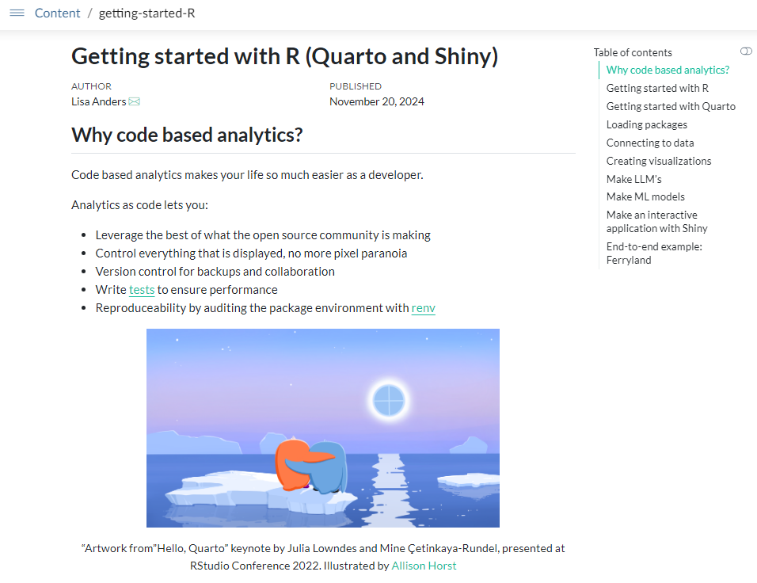

# Getting started with R (Quarto and Shiny)



## Usage

Setup the `renv` environment:

```r
renv::activate()
renv::restore()
```

To render the document either open `getting-started-R.qmd` and use the "Render" button on the top of the IDE code pane or use:

```r
quarto::quarto_render("getting-started-R.qmd")
```

## Deployment

### Push Button

Open `getting-started-R.qmd` and use the blue publish icon in the upper right corner of the IDE code pane.

### rsconnect package

You can also deploy using the rsconnect package:

```
rsconnect::deployDoc(
  doc = "getting-started-R.qmd",
  appTitle = "Quarto (with Connect): Getting started with R"
)
```

### Quarto CLI

```
quarto publish connect getting-started-R.qmd
```

### Git-backed

Update the code, and then run:

```r
rsconnect::writeManifest(quarto = TRUE, appPrimaryDoc="getting-started-R.qmd")
```

Commit the new `manifest.json` file to the git repo along with the code.

## Resources

- [Posit Connect User Guide: Quarto](https://docs.posit.co/connect/user/quarto/)

