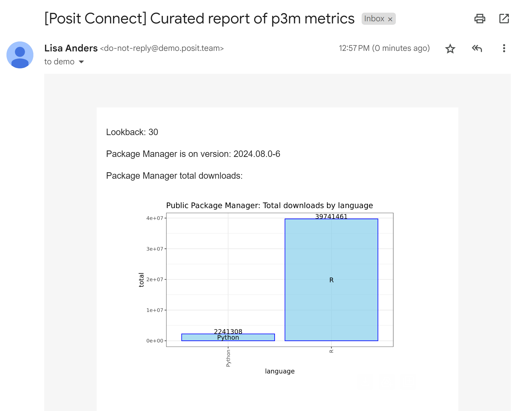

# Custom Conditional Email Outputs with `Quarto`



## Usage

Setup the `renv` environment:

```r
renv::activate()
renv::restore()
```

To render the document either open `email/ppm-report.qmd` and use the "Render" button on the top of the IDE code pane or use:

```r
quarto::quarto_render("email/ppm-report.qmd")
```

## Deployment

### Push Button

Open `email/ppm-report.qmd` and use the blue publish icon in the upper right corner of the IDE code pane.

### rsconnect package

You can also deploy using the rsconnect package:

```
rsconnect::deployDoc(
  doc = "email/ppm-report.qmd",
  appTitle = "Quarto Emails (with Connect): Including plots"
)
```

### Quarto CLI

```
quarto publish connect ppm-report.qmd
```

### Git-backed

Update the code, and then run:

```r
rsconnect::writeManifest("email")
```

Commit the new `manifest.json` file to the git repo along with the code.

## Resources

- [Posit Connect User Guide: Quarto Email Customization](https://docs.posit.co/connect/user/quarto/index.html#email-customization)

